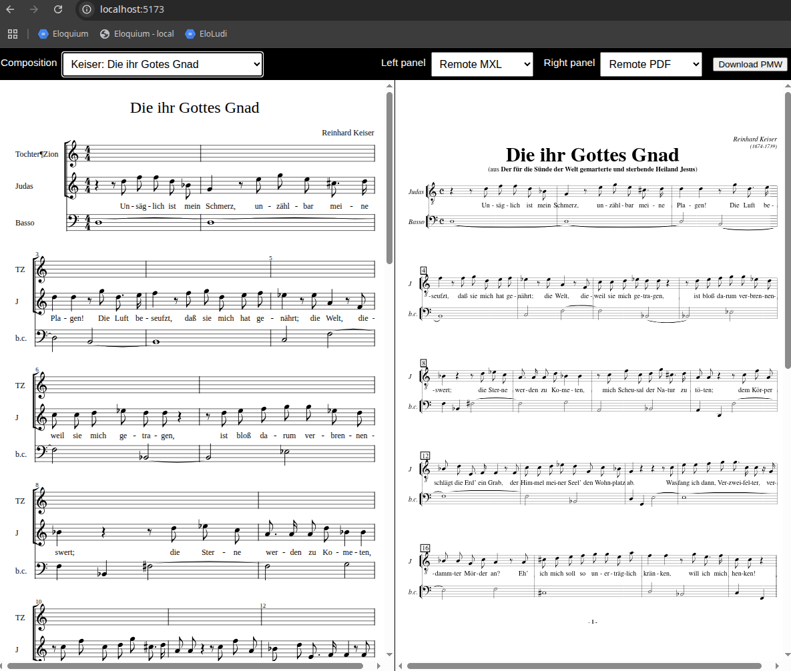

# osmd-viewer

This is a temporary project for testing MusicXML export from [PMW](https://philiphazel.github.io/pmw/) in a browser. The goal is to easily compare the original PDF, the MXL provided by CPDL (using OCR), and the local MXL generated by PMW.

I apologize for the code quality.

## Prerequisites

- Node.js >= 22.x
- npm

## Installation

```bash
npm install
```

## Running the Project

Start the development server:

```bash
npm run dev
```

Then open [http://localhost:5173/](http://localhost:5173/) in your browser.

## Usage

The file `config.js` contains preconfigured links to CPDL and the path to the local MusicXML file to be displayed. Modify this configuration as needed. If you set `localMXLPath`, the application will automatically refresh the panel view whenever the file changes.

After starting the application, use the top bar to select the piece to display and choose the modes for the left and right panels.


